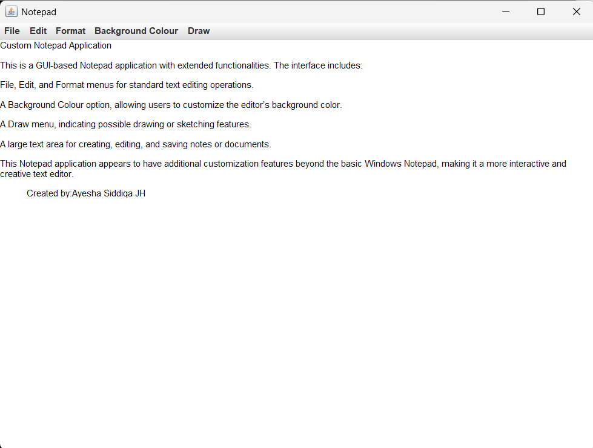
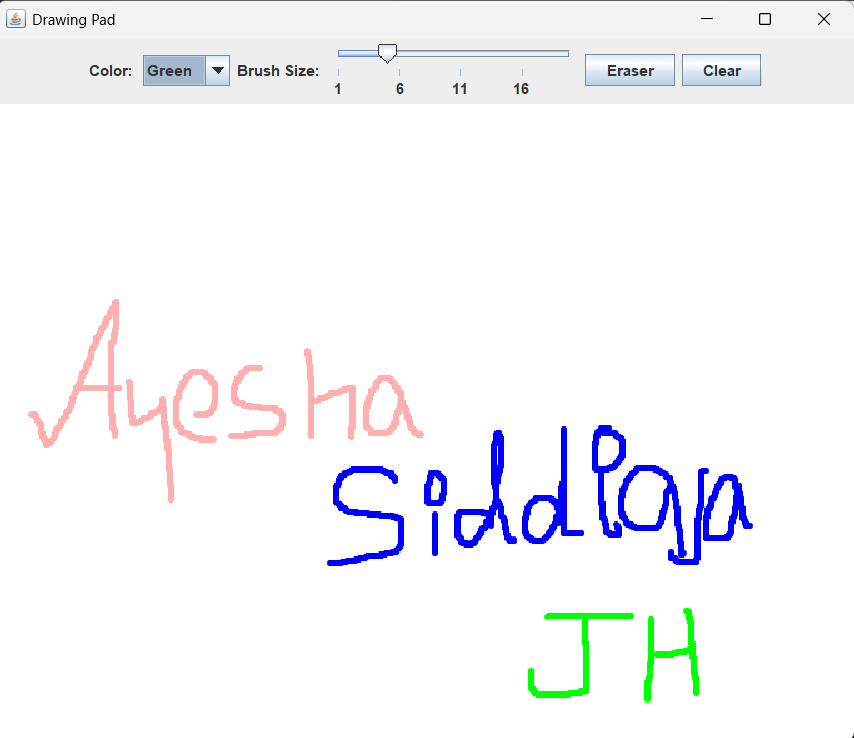
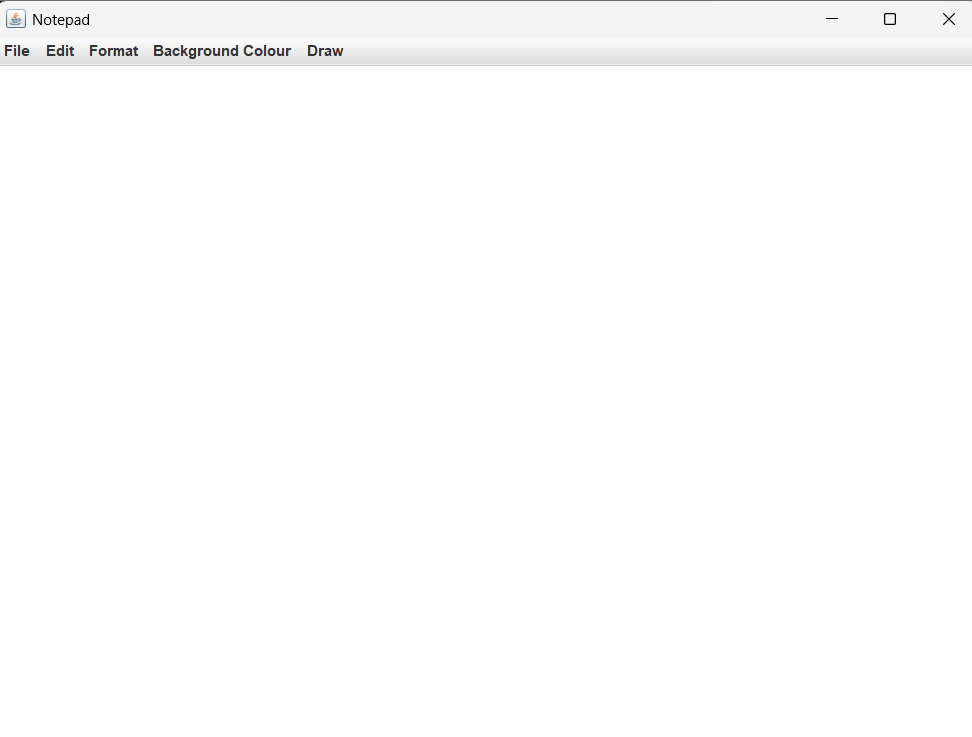

# 📝 Notepad using JAVA  

This is a **GUI-based Notepad application** with:  
- **File, Edit, and Format** menus for text editing.  
- **Background Colour** customization.  
- A **Draw** option for sketching.  
- Large text area for writing and editing notes. 💻  

## 🚀 Technologies Used  
- **Java**  
- **Swing/AWT** for GUI development  

## 🛠️ Output Screenshots  

### 📜 **Text Editing Interface**
  

### 🎨 **Drawing Feature**
  

### 🖥️ **Main Notepad Interface**
  

